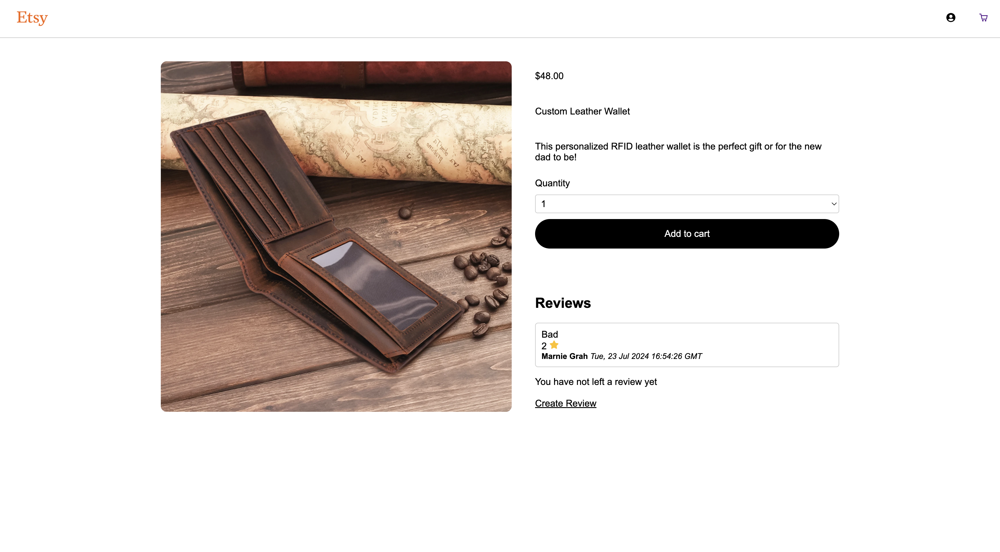
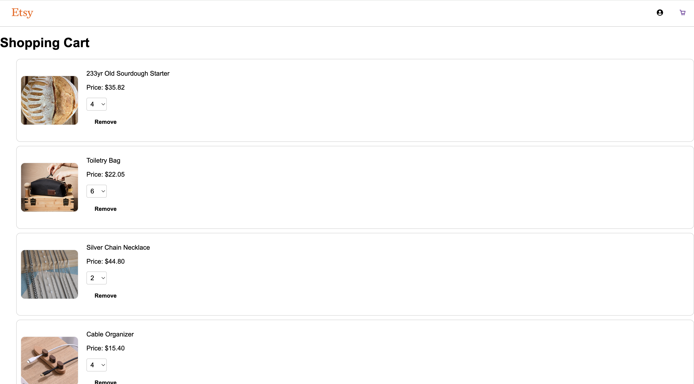
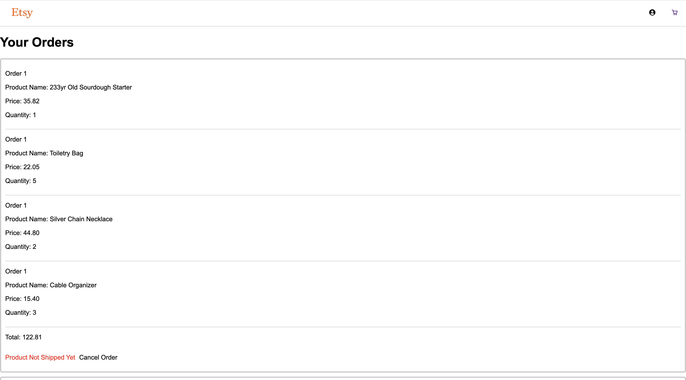

# EtsyClone

EtsyClone is a  partial clone of the popular e-commerce website "Etsy". It aims to provide users with a a smooth online shopping experience and allow owners to manage their products efficiently. Additionally, it offers complete review management for users.

# Live Link
https://etsyclone-4ah1.onrender.com/


## Tech Stack
      
[db-schema]: ./images/DB_schema.png

 ### Database:
 

  ### Hosting:
 

# Index

 [MVP List and Database Schema](https://github.com/TomArbaugh/EtsyClone/wiki#mvp-list) | [User Stories](https://github.com/TomArbaugh/EtsyClone/wiki#user-stories) 

# Landing Page/Products Page
 

# Products Details Page
 

# Shopping Cart Page
 

# Order Page
 

# Endpoints

## Auth Routes

### Current User
##
* Purpose: Authenticates a user
* Method: ```GET```
* URL: ```/api/auth/```
* Successful Response: HTTP Status Code 200
```python
{
    "email": "demo@aa.io",
    "first_name": "Demo",
    "id": 1,
    "last_name": "User",
    "username": "Demo"
}
```
* Error Response: HTTP Status Code 401
```python
{ "errors": { "message": "Unauthorized" } }
```
### Unauthorized (from @login_required)
##
* Purpose: This endpoint will be routed to in the case that a protected route does not pass validations for the current user.
* Method ```POST```
* URL: ```/api/auth/unauthorized```
* Successful Response: NA 
* Error Response: HTTP Status Code 401
```python
{ "errors": { "message": "Unauthorized" } }
```
### Sign Up
##
* Purpose: This fetch sends the signup form data to the backend to process the creation of a new user.
* Method: ```POST```
* URL: ```/api/auth/signup```
* Successful Response: HTTP Status 201
```python
{ 
    "email": "test@aa.io", 
    "first_name": "Test", 
    "id": 4, 
    "last_name": "Testor",
     "username": "test" 
}
```
* Error Response: HTTP Status 401
```python
{
    "username": [
        "This field is required.",
         "Username must be between 3 and 30 characters", 
         "Username is already in use."
         ],
    "first_name": [
        "This field is required.", 
        "First name must be between 3 and 30 characters"
        ],
    "last_name": [
        "This field is required.", 
        "Last name must be between 3 and 30 characters"
        ],
    "email": [ 
        "This field is required.",  
        "Email address is already in use."
        ], 
    "password": [ 
        "This field is required.", 
        "Password must be between 6 and 20 characters" 
        ],
}
```
### Login
##
* Purpose: This fetch attempts to login a user with the provided credentials.
* Method: ```POST```
* URL: ```/api/auth/login```
* Successful Response: HTTP Status 200
```python
{ 
    "email": "demo@aa.io", 
    "first_name": "Demo", 
    "id": 1, 
    "last_name": "User", 
    "username": "Demo" 
}
```
* Error Response: HTTP Status 401
```python
{
    "email": [ 
        "This field is required.",  
        "Email provided not found." 
        ], 
    "password": [ 
        "This field is required.", 
        "No such user exists.", 
        "Password was incorrect." ] 
}
```
### Logout
##
* Purpose: This fetch will logout the current user.
* Method: ```GET```
* URL: ```/api/auth/logout```
* Successful Response: HTTP Status 200
```python
{
   'message': 'User logged Out'
}
```
## Product Routes

### All Products
##
* Purpose: Get all products 
* Method: ```GET```
* URL: ```/api/products/```
* Successful Response: HTTP Status Code 200
```python
{ 
    "products": [ 
        {
            "category": "Home & Living", 
            "created_at": "Sun, 07 Jul 2024 21:29:35 GMT", 
            "description": "Customized Neon sign that reads out your preferred Name, Text, Font, Shape, Style, and Color.", 
            "id": 1, 
            "images": [ 
                { 
                    "id": 1, 
                    "product_id": 1, 
                    "url": "https://etsy-clone-july24.s3.us-west-1.amazonaws.com/images-for-EstyClone/10-Custom-Neon-Sign.png" 
                } 
                ],
            "name": "Custom Neon Sign",
            "owner_id": 3, 
            "price": "7.99", 
            "stock": 20 
        },
        {  
            "category": "Clothing & Shoes", 
            "created_at": "Mon, 03 Jun 2024 12:00:00 GMT", 
            "description": "50% Cotton, 50% Polyester. Double-needle stitched neckline, bottom hem and sleeves t-shirt. All hoodies and crewneck sweatshirts are fleece.", 
            "id": 2, 
            "images": [ 
                { 
                    "id": 2, 
                    "product_id": 2, 
                    "url": "https://etsy-clone-july24.s3.us-west-1.amazonaws.com/images-for-EstyClone/8-Custom-Embroidered-Sweatshirt.png" 
                } 
            ], 
            "name": "Custom Embroidered Sweatshirt", 
            "owner_id": 3, 
            "price": "34.20", 
            "stock": 18 
        },
    ]
}
```

### Product Details
##
* Purpose: Get a product by ID
* Method: ```GET```
* URL: ```/api/products/<int:product_id>```
* Successful Response: HTTP Status Code 200
```python
{ 
    "category": "Home & Living", 
    "created_at": "Sun, 07 Jul 2024 21:29:35 GMT", 
    "description": "Customized Neon sign that reads out your preferred Name, Text, Font, Shape, Style, and Color.", 
    "id": 1, 
    "images": [ 
        { 
            "id": 1, 
            "product_id": 1, 
            "url": "https://etsy-clone-july24.s3.us-west-1.amazonaws.com/images-for-EstyClone/10-Custom-Neon-Sign.png" 
        } 
    ], 
    "name": "Custom Neon Sign", 
    "owner_id": 3, 
    "price": "7.99", 
    "stock": 20 
}
```
* Error Response: HTTP Status Code 404
```python
{'errors': {'message': 'Product not found'}}
```

### Create New Product
##
* Purpose: Add a new product to owner's listing
* Method: ```POST```
* URL: ```/api/products/```
* Successful Response: HTTP Status Code 201
```python
{
    "category": "Home & Living", 
    "created_at": "Tue, 23 Jul 2024 22:53:59 GMT", 
    "description": "Walnut Live Edge Computer Desk with Drawer Storage", 
    "id": 11, 
    "images": [], 
    "name": "Desk", 
    "owner_id": 4, 
    "price": "296.99", 
    "stock": 30 
}
```
* Error Response: HTTP Status Code 400
```python
{
    "errors": { 
        "name": [ "This field is required.", "Field cannot be longer than 50 characters." ],
        "category": [ "This field is required.", "Field cannot be longer than 50 characters." ],
        "description": [ "This field is required.","Field cannot be longer than 255 characters." ],
        "price": [ "This field is required.", "Number must be at least 0."],
        "stock": [ "This field is required.", "Number must be at least 0."]

    } 
}
```

### Update Product
##
* Purpose: Update a product by ID (only accessible to the creator of the product)
* Method: ```PUT```
* URL: ```/api/products/<int:product_id>```
* Successful Response: HTTP Status Code 201
```python
{ 
    "category": "Home & Living", 
    "created_at": "Tue, 23 Jul 2024 22:56:42 GMT", 
    "description": "Walnut Live Edge Computer Desk with Drawer Storage",
     "id": 13, 
     "images": [], 
     "name": "Desk", 
     "owner_id": 4, 
     "price": "299.99", 
     "stock": 30 
}
```
* Error Response: HTTP Status Code 404
```python
{'errors': {'message': 'Product not found'}}
```
* Error Response: HTTP Status Code 403
```python
{'errors': {'message': 'You are not authorized'}}
```
* Error Response: HTTP Status Code 400
```python
{
    "errors": { 
        "name": [ "This field is required.", "Field cannot be longer than 50 characters." ],
        "category": [ "This field is required.", "Field cannot be longer than 50 characters." ],
        "description": [ "This field is required.","Field cannot be longer than 255 characters." ],
        "price": [ "This field is required.", "Number must be at least 0."],
        "stock": [ "This field is required.", "Number must be at least 0."]

    } 
}
```

### Delete Product
##
* Purpose: Delete a product by product owner
* Method: ```DELETE```
* URL: ```/api/products/<int:product_id>```
* Successful Response: HTTP Status Code 200
```python
{'message': 'Product delete successfully'}
```
* Error Response: HTTP Status Code 404
```python
{'errors': {'message': 'Product not found'}}
```
* Error Response: HTTP Status Code 403
```python
{'errors': {'message': 'You are not authorized'}}
```

### Current User Products
##
* Purpose: Get all products owned by logged-in current user
* Method: ```GET```
* URL: ```/api/products/current```
* Successful Response: HTTP Status Code 200
```python
{
  "products": [
    {
      "category": "Jewelry & Accessories",
      "created_at": "Sun, 02 Jun 2024 12:00:00 GMT",
      "description": "This personalized RFID leather wallet is the perfect gift or for the new dad to be!",
      "id": 3,
      "images": [
        {
          "id": 3,
          "product_id": 3,
          "url": "https://etsy-clone-july24.s3.us-west-1.amazonaws.com/images-for-EstyClone/1-Custom-Leather-Wallet.png"
        }
      ],
      "name": "Custom Leather Wallet",
      "owner_id": 1,
      "price": "48.00",
      "stock": 11
    },
    {
      "category": "Home & Living",
      "created_at": "Thu, 08 Jun 2023 12:00:00 GMT",
      "description": "The Personalized Dopp Kit has ample space to fit all of your travel-size containers and is long enough for grooming essentials like a toothbrush and a shaving kit.",
      "id": 8,
      "images": [
        {
          "id": 8,
          "product_id": 8,
          "url": "https://etsy-clone-july24.s3.us-west-1.amazonaws.com/images-for-EstyClone/3-Toiletry-Bag.png"
        }
      ],
      "name": "Toiletry Bag",
      "owner_id": 1,
      "price": "22.05",
      "stock": 13
    },
  ]
}
```

## Reviews

### all Reviews For a Product
##
* Purpose: Get all Reviews For a Product
* Method: ```GET```
* URL: ```/api/reviews/:product_id/reviews```
* Successful Response: HTTP Status Code 200
```python
[
    {
        "user_id": record.user_id,
        "first_name": record.first_name,
        "last_name": record.last_name,
        "product_id": record.product_id,
        "review": record.review,
        "stars": record.stars,
        "createdAt": record.created_at,
        "updatedAt": record.updated_at
    }
]
```


# Future Features List
1. favorite

# Future Implementation Goals
1. Search Bar

# Connect
[LinkedIn]()